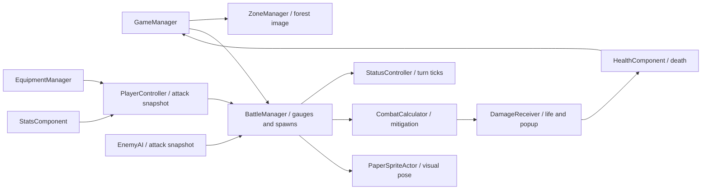

# Black Cube developer handoff

## Authoritative reading order

Read these documents in order before changing behavior:

1. [GAME_DESIGN_CONTRACT.md](GAME_DESIGN_CONTRACT.md) — intended behavior and design law.
2. [PROJECT_STATE.md](PROJECT_STATE.md) — what the verified repository currently does.
3. This handoff — workflow and practical entry points.
4. [CODE_MAP.md](CODE_MAP.md) — file ownership and script connections.
5. [RUNTIME_LIFECYCLE.md](RUNTIME_LIFECYCLE.md) — lifecycle, reset and transition rules.
6. [SAVE_STATE_CONTRACT.md](SAVE_STATE_CONTRACT.md) — persistence rules.
7. [PASSIVE_TREE.md](PASSIVE_TREE.md) — passive-tree specifics.

Code is evidence for current state, not automatic authority for intended design. If implementation and design disagree, report and register the discrepancy instead of silently changing either side.

For UI work, Codex owns functional controls, sensible basic placement and component wiring. The user retains final ownership of custom art, animated interaction states, precision alignment, bespoke sprite transitions and presentation polish. Runtime-built/basic controls therefore do not lock final visual design.

Step 6 verification is green in Unity 6000.6.0f1: 136/136 EditMode tests, the rich real-scene save→menu→load/New Game check, the six-entry lifecycle and Pause Menu soak, all four synchronous gameplay checks, and missing-reference validation with zero failures. A fresh Windows x64 build completed with zero errors and remained running through the standalone smoke window. Reports are written under `Logs/` by the corresponding runners. Older file-only assertion reports remain useful supplemental checks; see [final-handoff-checks.json](final-handoff-checks.json) and the [enemy batch report](../ReviewCaptures/ForestEnemies/README.md).

Runtime ownership, reset and transition rules are recorded in [RUNTIME_LIFECYCLE.md](RUNTIME_LIFECYCLE.md). Persistent managers are first created by gameplay, detach from their authored prefab parent before `DontDestroyOnLoad`, clear gameplay references on unload, and bind only objects from the new gameplay scene. Confirmed New Game now clears the entire saved gameplay profile—including relic history, rebirth cycle and Ancient currency—while preserving independent preferences.

The implemented Step 6 persistence contract is recorded in [SAVE_STATE_CONTRACT.md](SAVE_STATE_CONTRACT.md). `GamePersistence.TrySave` writes schema-v2 UTF-8 JSON under `Application.persistentDataPath` through a validated temporary file, atomic primary replacement, and one backup. Load validates before mutation, falls back primary→backup, migrates historical `BlackCube.Save.V1` only when no new-format file exists, and restores a deterministic clean encounter start with recorded player life/mana. Pause Menu Save & Main Menu / Save & Quit remain gated on that one canonical entry point.

## Open and navigate

The project currently records **Unity 6000.6.0f1** in [ProjectVersion.txt](../ProjectSettings/ProjectVersion.txt). Open the project with that version and let Unity finish importing. Package versions, including URP and UGUI, are pinned in [manifest.json](../Packages/manifest.json).

The playable paper scene is [SampleScene.unity](../Assets/Scenes/SampleScene.unity), with [PaperBattle.prefab](../Assets/Prefabs/PaperBattle/PaperBattle.prefab) as the main saved setup. Runtime scripts are in `Assets/Scripts`; Unity tools/checks are in `Assets/Editor`; file-only art/check tools are in `Tools/Art`. Original 3D content and previous art experiments remain in the project. They are not the active paper presentation.

Edit the main prefab for scene wiring. [PaperBattleSceneBuilder.cs](../Assets/Editor/PaperBattleSceneBuilder.cs) can rebuild it from the legacy `Assets/Scenes/Scene.prefab`, then replace SampleScene. **It writes assets and the scene**, so preserve manual edits and update the builder when changing permanent wiring. UI/stat/damage-style builders also write their outputs. Most `Black Cube/Play Checks` menu entries enter Play and create temporary fixtures; inspect the specific check before running. The file-only scripts below do not launch Unity.

## What runs, in order

1. [PlayerStatSetup](../Assets/Scripts/PlayerStatSetup.cs) initializes baseline stats early (`DefaultExecutionOrder(-100)`). [HealthComponent](../Assets/Scripts/HealthComponent.cs) reads player Life. Enemy health uses its serialized `maxLife` instead.
2. [PlayerController.Start](../Assets/Scripts/PlayerController.cs) equips a starter weapon if needed: base damage 80, speed 1.2 attacks/second, base crit 5%. [EquipmentManager](../Assets/Scripts/EquipmentManager.cs) applies global modifiers and informs the player which weapon is equipped.
3. [GameManager](../Assets/Scripts/GameManager.cs) starts the session and combat level. [ZoneManager](../Assets/Scripts/ZoneManager.cs) selects the background. [BattleManager](../Assets/Scripts/BattleManager.cs) instantiates the normal enemy at its serialized spawn transform and initializes its components/gear.
4. BattleManager fills separate player/enemy gauges and resolves turns. It ticks both actors' statuses before a turn's attack. Damage may kill an actor and synchronously change the encounter, so target-identity and life checks must remain after status and damage callbacks.
5. [DamageReceiver](../Assets/Scripts/DamageReceiver.cs) deducts already-mitigated life and requests a popup. HealthComponent reports death to GameManager; `TryClaimEnemyDeath` prevents duplicate XP/loot callbacks.
6. Nine normal kills trigger encounter stage ten in the boss slot; boss death advances the combat level. XP and loot are awarded before the next spawn. A player death opens [DeathMenuUI](../Assets/Scripts/DeathMenuUI.cs); restarting the current level resets encounter progress but keeps XP/skills.



## Combat and damage

BattleManager is the timing authority. At `turnThreshold = 100`, gauge increment is `attacksPerSecond * 100 * deltaTime`, so one hit takes `1 / attacksPerSecond` seconds. Changing the threshold also changes cadence. A maximum of ten turns is resolved per Update to bound catch-up work; at very high speeds multiple hits can share one rendered frame.

Player attacks use [BuildNonCriticalAttackContext](../Assets/Scripts/PlayerController.cs) for previews and apply one critical roll in `BuildAttackContext` for actual combat. Each typed component is part of one hit. The damage formula is `(effective weapon base + matching global flat) * (1 + elemental increased + generic increased) * product(1 + each applicable more roll / 100)`. Extra flat elements are scaled separately; do not include the weapon base twice. [EnemyAI](../Assets/Scripts/EnemyAI.cs) builds comparable contexts from generated enemy gear.

[CombatCalculator](../Assets/Scripts/CombatCalculator.cs) applies armour and physical penetration to Physical damage. Non-Physical hits use resistance and matching penetration, clamped from -90% to 90%; ailment ticks have their own resistance path. `StatMappings.GetResistStat` rejects Physical lookups because the live hit path does not use a Physical resistance stat. The `Max*Res` stats do not replace the calculator's hard-coded cap. Penetration and CritMult are not classified percent stats in StatsComponent, so their existing raw values are treated as fractions. Audit their data before balancing them as percentage points.

To change starting damage/speed, edit `CreateStarterWeapon`. To change overall scaling, edit the attack context formulas on both player/enemy and use the attack-stat fixtures. To change defenses, edit CombatCalculator and test a known fixed hit against zero and nonzero defenses. Do not add damage to animation events; that duplicates the gauge hit.

## Stats, equipment and inventory

[StatsComponent](../Assets/Scripts/StatsComponent.cs) stores raw values. Classified percentage buckets store **20 for 20%**; `GetStat` returns **0.20**, while `GetRawStat` returns 20. Flat HP remains HP. [StatValue](../Assets/Scripts/StatValue.cs) computes `(base + flat + additive) * multiplicative`, with independent percentage-point factors for every more-damage roll. More-damage GetRawStat returns the effective percent (two20% rolls return44), and GetStat returns its fraction (.44). A base more value is one factor; Override still replaces the final value. The gameplay formula applies these buckets afterward. This is not a universal `(base + flat) * (1 + increased)` stat engine.

[Gear.ApplyMods](../Assets/Scripts/Gear.cs) routes matching weapon damage, attack speed and crit into local fractional fields, and other rolls into `globalRolledMods`. It accumulates: call once for newly generated gear, not repeatedly to refresh UI. EquipmentManager removes old modifiers **by source Gear object**, then applies the new ones in `BeginUpdate`/`EndUpdate` so health/UI receive one final stat notification. `EquipmentChanged` refreshes equipped slots; `PlayerController.AttackChanged` refreshes attack previews and world weapon visuals.

Use EquipmentManager.Equip/Unequip for normal inventory operations; setting PlayerController's weapon alone does not apply global item modifiers. [Inventory.Pickup](../Assets/Scripts/Inventory.cs) applies auto-dismantling once to new loot. `Inventory.Add` returns a swapped/unequipped item without pickup filtering. Level and rarity filters use OR, not AND. Dismantling yields 1/2/3/5 random ordinary crafting currencies for Normal/Magic/Rare/Legendary; manual and filter dismantling share the same authority, and legacy Scrap stacks migrate into ordinary currency.

[CraftingCurrencySystem](../Assets/Scripts/CraftingCurrencySystem.cs) owns stackable currencies and armed-target interaction. Normal items have one locked original affix; Magic has two; Rare starts at three and caps at four. Upgrade operations preserve existing affixes, while add/reroll/remove never select the locked original. Weapon base rolls do not count toward these caps. All new rolls delegate to ModManager, preserving the same item-level, group, element and weight rules used by drops. Right-click a currency to arm/cancel it; a valid next left-click consumes one, while an invalid target consumes nothing.

[RelicSystem](../Assets/Scripts/RelicSystem.cs) owns level-50 rebirth, permanent relics, four active relic slots and relic-only Ancient crafting. Rebirth requires an explicit confirmation, resets run progression/equipment/ordinary inventory/currency, locks older relics, creates one current-cycle relic, replaces Ancient currency, and immediately checkpoints. Relic identities and active slots persist by stable ID. This permanence is within a saved game: confirmed New Game clears all relic/rebirth state. Main Menu Load accepts a valid schema-v2 primary, backup recovery, or one-time V1 migration; final button art and animated states remain future presentation work.

To add a stat: preserve [StatTypes](../Assets/Scripts/StatTypes.cs) numeric identities, decide its units in `IsPercentStat`, configure [GearStatLists](../Assets/Scripts/GearStatLists.cs), [ModDatabase](../Assets/Scripts/ModDatabase.cs)/[AffixDefinitions](../Assets/Scripts/AffixDefinitions.cs), add actual formula consumption, and update display mappings/tests. Merely exposing a stat in the UI does not implement a mechanic. [ModManager](../Assets/Scripts/ModManager.cs) controls rolling weights, item-level gates and exclusion groups; guaranteed weapon bases are additional to the random affix count.

## Player sprites and swappable weapons

Active files: [ChibiPlayer](../Assets/Art/PaperBattle/ChibiPlayer), [PlayerAnimation.asset](../Assets/Art/PaperBattle/ChibiPlayer/PlayerAnimation.asset), [DefaultSword.asset](../Assets/Art/PaperBattle/ChibiPlayer/DefaultSword.asset). Body PNGs contain empty hands; Sword.png contains the whole weapon including its handle. Gear can reference a [PaperWeaponVisual](../Assets/Scripts/PaperWeaponVisual.cs). Nonempty equipment without a custom profile uses DefaultSword; **a null equipped weapon always hides the sprite**.

Each body is 640×640 at 150 pixels/unit, feet near pixel row 612, with normalized pivot `(0.5, 0.04375)`. Source image coordinates are top-down; Unity coordinates are bottom-up. A hand at `(hx,hy)` maps to `((hx-320)/150, (612-hy)/150)`. Angles are degrees from +X. The idle sword now carries forward/down at -25 degrees, in front of the body; attack endpoints match. The weapon profile can offset a non-grip pivot and specify scale. A new weapon with substantially different anatomy/two-hand grip needs appropriate poses, not just a different sprite.

The idle loop has eight drawings at two frames/second. Attack slot four is impact. The gauge is phase-shifted so initial windup starts at 62.5% charge and slot four lands at the damage threshold; after impact, recovery follows the same clock. `impactTick` prevents a synchronous next-enemy spawn or LateUpdate from erasing the impact in its rendered frame.

Current reproducible player pipeline, in order:

1. [prepare_chibi_player.py](../Tools/Art/prepare_chibi_player.py): source-sheet background cleanup and body registration. Source paths are recorded in the script and copied to ReviewCaptures/ChibiPlayer. Dense ink bands locate figures, then empty gutters and complete alpha bounds preserve sparse hair tips. The old dense-band crop was the rectangular hair clipping cause; the installed canvas has padding and the importer uses Full Rect.
2. [chibi_player_attachments.py](../Tools/Art/chibi_player_attachments.py): edit source-space hand anchors/angles/layers here; writes attachments.json and four equipped/unarmed GIFs.
3. [install_chibi_player.py](../Tools/Art/install_chibi_player.py): writes PNG metadata, profiles and prefab fields with stable GUIDs.
4. [verify_chibi_player_assets.py](../Tools/Art/verify_chibi_player_assets.py): checks bounds and installed references. Inspect contact sheets too; automated bounds cannot judge animation quality.

Older PlayerIdle/PlayerAttack installers are archived experiments and may overwrite current wiring. CODE_MAP labels them. Do not run all art scripts as a batch. Python utilities can execute at module import; only documented helper imports are intended.

## Enemies, forest stages and progression

Normal and boss selection are serialized `normalEnemyPrefab`/`bossEnemyPrefab` references on BattleManager in PaperBattle.prefab: [Goblin2D.prefab](../Assets/Prefabs/PaperBattle/Goblin2D.prefab) and [Hobgoblin2D.prefab](../Assets/Prefabs/PaperBattle/Hobgoblin2D.prefab). These apply across all six forest stages with the nine-normal-kills-then-stage-ten-boss cadence. Normal HP remains 250 and boss HP 500. Do not change random EnemyRarity to decide boss role: HealthComponent's spawned boss flag is authoritative.

[PaperEnemyAnimationSet](../Assets/Scripts/PaperEnemyAnimationSet.cs) configures display name, rest/attack frames and popup offset. [GoblinAnimation.asset](../Assets/Art/PaperBattle/ForestEnemies/GoblinAnimation.asset) and [HobgoblinAnimation.asset](../Assets/Art/PaperBattle/ForestEnemies/HobgoblinAnimation.asset) feed PaperSpriteActor. The shared eight-frame gauge convention now also drives enemies; ResolveEnemyTurn selects impact immediately before actual damage, after status-kill/target guards. Enemy weapons are baked into their authored cels; the player's separate equipment attachment path remains independent. The resting enemy uses one stable pose and the attack cycle returns exactly to it.

Enemy source/preparation/preview files are in [ReviewCaptures/ForestEnemies](../ReviewCaptures/ForestEnemies). Run [prepare_forest_enemies.py](../Tools/Art/prepare_forest_enemies.py), then [install_forest_enemies.py](../Tools/Art/install_forest_enemies.py), then [verify_forest_enemies.py](../Tools/Art/verify_forest_enemies.py). Sprites use 1152×896 padded canvases at 150 pixels/unit, sole row 816, pivot `(0.5, 80/896)`. The normal is approximately 3 world units tall and boss 3.8. Preparation extracts connected silhouettes instead of rigid grid cells so extended weapons cannot be clipped by column boundaries. It scales each species uniformly and uses no synthetic inbetween warping.

EnemyAI creates level-dependent gear; enemy HP is the prefab's `maxLife`. EnemyStatSetup.SetupForZone and ZoneManager's HP/damage multiplier getters are not a complete scaling pipeline. Preserve existing stats when replacing presentation. The legacy ghoul assets can remain for reference.

Enemy gear generation rolls every candidate before selection. Each chosen slot receives one candidate per ten-level band (1 at levels 1–10 through 10 at 91–100), then `EnemyBuildOptimizer` uses a deterministic 40-entry beam with four-entry physical/fire/cold/light/critical/poison/ignite/bleed reservations. It evaluates actual aggregated hit, critical, attack-speed, penetration, ailment, life, mitigation and recovery formulas over an explicit 10-second reference horizon, then applies the winning `Gear` objects through EnemyAI's normal modifier pipeline. The unknown future player is represented by exposed reference constants in that class; final ranking is `0.75*ln(offense) + 0.25*ln(defense)`.

The optimizer intentionally gives no invented value to roll-eligible mechanics that have no current enemy-combat consumer: block, evasion, maximum-resistance caps, accuracy, mana stats, kill recovery, cooldown, skill levels, attributes and attribute-scaling stats, and shock/chill gameplay effects or defenses. Hit twice is functional for the player in `BattleManager`, but enemy turns do not consume it, so the enemy optimizer still assigns it no value. These remain possible dead rolls on enemy gear until their enemy-side runtime mechanics exist.

[ZoneManager.ForestBackgroundIndex](../Assets/Scripts/ZoneManager.cs) is `((max(1,level)-1)/10)%6`: levels 1–10 use 0%, 11–20 use 20%, through 51–60 at 100%; 61 returns to 0%. The combat level keeps increasing. Within each combat level, encounter stages1-9 are goblins and stage10 is the hobgoblin boss. GameManager.EncounterStage supplies this HUD number. ZoneManager.StageNumber is a legacy background-group field; it is not the encounter counter. The six sprites in [ForestCycle](../Assets/Art/PaperBattle/ForestCycle) control the current background; legacy zoneNames, ThemeSet and 3D plans do not override a valid six-sprite configuration. `generate3DScenery` stays false in the paper prefab.

[PlayerProgression](../Assets/Scripts/PlayerProgression.cs) owns the 290-node passive tree. Existing IDs 0–279 remain stable; ten specialized keystones append 280–289 directly beyond their bridge terminals. `PassiveKeystoneState` recomputes all twenty keystone effects without mutating base stats. The outer travel ring exits laterally from both sides of every specialized terminal; each outer keystone remains a radial leaf and is never required for ring travel. Deep Freeze's maximum-effect increase remains a centralized zero-default tuning field pending balance. See [PASSIVE_TREE.md](PASSIVE_TREE.md) for graph, mechanics, art, zoom, and migration rules.

## Statuses, UI and other systems

[AilmentCalculator](../Assets/Scripts/AilmentCalculator.cs) selects eligible source elements: Poison physical/poison, Bleed physical, Ignite fire, Chill cold, Shock lightning. Chance is a single probability check; values above 100% do not add extra stacks. Tick duration/rate are **global turns**, not seconds. Both actor turns tick both status controllers, so changing attack speed changes real-time DOT pacing. Generic DOT and matching ailment more rolls each multiply independently on the already-scaled source hit; hit scaling is not reapplied. Extra duration adds equally strong ticks; it does not dilute each tick. The four stack policies are in StatusController. Its Display partial also supplies frequency-weighted tick averages; changing tooltip summary math can affect actual ticks.

The HUD reads state; InventoryUI/PlayerStatsPanelUI manage views from change events. ItemTooltipUI formats actual item values and protects equipped items from scrapping. DamagePopup renders numbers after life loss and uses a snapshot position so a destroyed enemy does not drag the popup. EquipmentGlyph/StatusGlyph/DamageNumberAccent generate UI mesh art. Legacy ThemeSet/ThemeDefinition/LevelGenerator/Pool build optional 3D scenery; they are separate from the paper forest and battle spawn points. LevelGenerator reseeds Unity's global RNG, so enabling it can affect later random rolls.

Implemented: auto-combat, equipment/local-global stat scaling, loot/inventory/filter/currency crafting, save/load, XP/skills, rebirth/relics, DOT stacking, status displays, death/restart, and paper backgrounds/poses. Present but incomplete: evasion has stat fields only and no hit test; shock/chill have display/lifetime plumbing but no gameplay response; the older prestige reward hook still auto-continues; achievements are absent; status virtual hooks are not dispatched; several enum stats and legacy theme/bounds fields have no consumer.

## How to validate changes yourself

From the project root in PowerShell, run each C# harness in a **fresh PowerShell process** (Add-Type cannot redefine the same types). Run Python with Pillow and NumPy installed; the machine's bundled interpreter is currently `C:/Users/david/.cache/codex-runtimes/codex-primary-runtime/dependencies/python/python.exe`.

```powershell
powershell -NoProfile -File Tools/Art/verify_combat_animation.ps1
powershell -NoProfile -File Tools/Art/verify_forest_cycle.ps1
powershell -NoProfile -File Tools/Art/verify_boss_cadence.ps1
python Tools/Art/verify_chibi_player_assets.py
python Tools/Art/verify_forest_assets.py
python Tools/Art/verify_forest_enemies.py
```

These are file/logic checks with stubs, not a Unity build. Forest source-identity checking requires the original `D:/Documents/BlackCubeAssets/Level Art/Forest/Forest 1` folder. If moving computers, update recorded source locations deliberately; do not treat missing source files as passing validation.

In Unity, wait for compilation and check Console errors. Open SampleScene and Play. Verify starter sword forward in idle, no clipped hair through all poses, empty equipment hides the full sword, and swap/re-equip refreshes it. Watch slow/fast attacks and damage numbers: the forward impact should coincide with life loss. Check pause, death, restart and target replacement; no extra hit should transfer to the next enemy. Validate goblin normal and hobgoblin boss at the normal/boss transition. Check forest boundaries 10/11, 20/21, 50/51, 60/61 and 120/121, keeping the combat level continuous. Verify inventory swap/scrap/filter, tooltips, XP/skill spending and status expiration.

For focused checks, use the `Black Cube/Play Checks` menu matching Attack Stats, Inventory/Grid, Tooltip Crit or Player Progression. Progression fixtures now expect nine normals and stage10 boss; legacy custom-theme fixtures explicitly clear the paper background configuration for that isolated test. Reports and previews live in ReviewCaptures. Stop Play afterward and avoid saving temporary fixture objects into the scene.

## This batch's boundaries

The documentation pass added responsibility/flow comments throughout 111 existing first-party files and corrected stale comments without changing their executable tokens. A baseline and coverage report are stored beside this guide. Separate authorized behavior/art changes are the player sword/crop fixes, goblin/hobgoblin presentation integration, and the final requested correction from ten normal kills plus boss to nine normals plus stage10 boss. The background still spans ten combat levels. No evasion or unrelated gameplay redesign is included. Unity was not launched for the file-only work; final test counts and remaining runtime checks are recorded in the batch reports.
