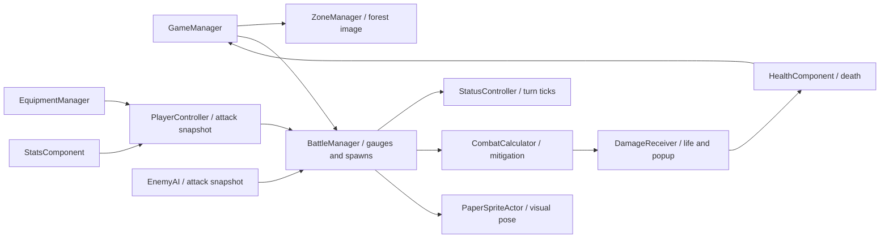

# Black Cube developer handoff

## Step 14 current integration note

Step 14.5 is the current repository baseline. Fresh runs and Rebirth share `PlayerController.EnsureStarterWeapon`; the unaided starter is 18–27 damage (22.5 average), 0.45 attacks/second, 5% base critical chance, and a deterministic minimum legal implicit. Rebirth unlocks from authoritative combat zone 60, creates a persisted level-1–100 relic from the reached zone, preserves active relics, applies their starter transformations, provisions exactly one starter, and then begins combat. Relic cards are full click/hover targets for equip/unequip and Ancient crafting. Equipment and tiered relic modifiers use `AffixTierWeightPolicy`; lower eligible tiers remain possible while expected quality rises with level. Persistence is schema 7, adding origin/Potential/Empowered/special provenance after schema 6's relic metadata. The authoritative v1 scope ledger and unresolved 360-world-content decisions are in [V1_CONTENT_CONTRACT.md](V1_CONTENT_CONTRACT.md).

## Step 12.5G integration note

Step 12.5G changes player equipment from the historical locked-explicit model to one permanent implicit plus 0/2/4/6 explicit capacities (Magic 1/1, Rare 2/2, Legendary 3/3). The implicit uses the already serialized `lockedOriginal` marker and may repeat an explicit family without consuming an explicit side; `GamePersistence` bumps to schema 4 to distinguish strict new gear from preserved schema-3 historical side excess. Natural player items roll full explicit counts, while crafting may intentionally under-fill. The authored starter weapon also rolls one legal implicit but does not apply randomized weapon-base overrides to its 64–96/1.2/5% baseline. Enemy intrinsic equipment retains its pre-pass modifier-count profile; this does not tune enemy scaling. Normal → Magic adds two explicits, Magic → Rare adds two without rerolling existing mods, each reroll touches one same-side explicit, and Add/Remove touch one explicit each; Remove works on Magic+. The supplied Ancient PNGs replace generated currency glyphs on inventory tiles/cursors; existing relic-currency mechanics are unchanged. The supplied gold reroll image is visually assigned to the existing Ancient Rare→Legendary upgrade because there is no matching seventh icon. Crit popups attach a compact star. Gear tooltips place the accented code-drawn padlock above Prefix/Suffix rows; the paused CODEX → MOD LIST reads the same ModDatabase and slot-relative tier definitions as rolling. Fresh 12.5G test/build evidence is in `PROJECT_STATE.md`; Step 13 balancing has not begun.

## Historical Step 12.5 integration note

The pre-12.5G Unity EditMode suite passed 212/212, the seeded itemization audit passed 1,312 cases, and four real-scene synchronous checks passed. Focused AttackStats, InventoryGrid, TooltipCrit and PlayerProgression fixtures, schema-3 menu/load, six-entry lifecycle/Pause and missing-reference scan passed; that historical strict Windows x64 build succeeded with zero errors (522 warnings) and its standalone player stayed responsive for 48 seconds. Fresh Step 12.5G evidence is 232/232 EditMode, 1,312 itemization cases, current-schema menu/load and lifecycle checks, zero-error strict Windows build (528 warnings), and a responsive standalone Main Menu smoke; see [PROJECT_STATE.md](PROJECT_STATE.md) for exact reports and the isolated-project lock caveat. Weapon damage is a min–max range (starter 64–96, average 80) rolled separately per real hit; noncritical previews use its average. Critical hits use a 1.5× base multiplier plus classified CritMult and show resolved life loss. Poison/Bleed/Ignite keep independent stacks; Poison schedules in global combat turns while Bleed/Ignite schedule in afflicted-actor turns. Loot/crafting/enemy items share variable tiers and Prefix/Suffix legality; direct ordinary PoE analogues, authored Black-Cube slot fallbacks and deliberate deviations are documented in [POEDB_AFFIX_BASELINE.md](POEDB_AFFIX_BASELINE.md). `GamePersistence.TrySave` now writes schema 4, stores paired damage endpoints, migrates schema-2 scalar rolls as X–X and schema-3 locked-original rolls to implicits, and marks historical items to avoid invalidating old gear. Relic cards/canonical Ancient art, the Void ordinary passive branch, exact-tier item tooltips and Inventory+Stats/Enemy overlay coexistence are functional. Step 6/10/11/12 counts/builds below are historical.

## Authoritative reading order

Read these documents in order before changing behavior:

1. [GAME_DESIGN_CONTRACT.md](GAME_DESIGN_CONTRACT.md) — intended behavior and design law.
2. [PROJECT_STATE.md](PROJECT_STATE.md) — what the verified repository currently does.
3. [STAT_AFFIX_AUDIT.md](STAT_AFFIX_AUDIT.md) — exhaustive stat/affix reality, triage, decisions and Step 10 backlog.
4. This handoff — workflow and practical entry points.
5. [CODE_MAP.md](CODE_MAP.md) — file ownership and script connections.
6. [RUNTIME_LIFECYCLE.md](RUNTIME_LIFECYCLE.md) — lifecycle, reset and transition rules.
7. [SAVE_STATE_CONTRACT.md](SAVE_STATE_CONTRACT.md) — persistence rules.
8. [PASSIVE_TREE.md](PASSIVE_TREE.md) — passive-tree specifics.

Code is evidence for current state, not automatic authority for intended design. If implementation and design disagree, report and register the discrepancy instead of silently changing either side.

For UI work, Codex owns functional controls, sensible basic placement and component wiring. The user retains final ownership of custom art, animated interaction states, precision alignment, bespoke sprite transitions and presentation polish. Runtime-built/basic controls therefore do not lock final visual design.

Step 6 verification is green in Unity 6000.6.0f1: 136/136 EditMode tests, the rich real-scene save→menu→load/New Game check, the six-entry lifecycle and Pause Menu soak, all four synchronous gameplay checks, and missing-reference validation with zero failures. A fresh Windows x64 build completed with zero errors and remained running through the standalone smoke window. Reports are written under `Logs/` by the corresponding runners. Older file-only assertion reports remain useful supplemental checks; see [final-handoff-checks.json](final-handoff-checks.json) and the [enemy batch report](../ReviewCaptures/ForestEnemies/README.md).

Runtime ownership, reset and transition rules are recorded in [RUNTIME_LIFECYCLE.md](RUNTIME_LIFECYCLE.md). Persistent managers are first created by gameplay, detach from their authored prefab parent before `DontDestroyOnLoad`, clear gameplay references on unload, and bind only objects from the new gameplay scene. Confirmed New Game now clears the entire saved gameplay profile—including relic history, rebirth cycle and Ancient currency—while preserving independent preferences.

The persistence contract is recorded in [SAVE_STATE_CONTRACT.md](SAVE_STATE_CONTRACT.md). `GamePersistence.TrySave` writes schema-7 UTF-8 JSON under `Application.persistentDataPath` through a validated temporary file, atomic primary replacement, and one backup. Load validates before mutation, falls back primary→backup, migrates schema 2 → 3 → 4 → 5 → 6 → 7 and historical `BlackCube.Save.V1`, and restores a deterministic clean encounter start with recorded player life/mana and no queued skill. Pause Menu Save & Main Menu / Save & Quit remain gated on that one canonical entry point.

Step 8 removed the superseded Prestige runtime route. Boss death now always advances directly to the next combat level after the existing empty zone-clear reward hook. Do not add a second reset path: New Game replaces the gameplay/meta save, Restart restarts the current combat level, Rebirth performs the approved relic/meta reset, and Load restores the current save.

## Open and navigate

The project currently records **Unity 6000.6.0f1** in [ProjectVersion.txt](../ProjectSettings/ProjectVersion.txt). Open the project with that version and let Unity finish importing. Package versions, including URP and UGUI, are pinned in [manifest.json](../Packages/manifest.json).

The playable paper scene is [SampleScene.unity](../Assets/Scenes/SampleScene.unity), with [PaperBattle.prefab](../Assets/Prefabs/PaperBattle/PaperBattle.prefab) as the main saved setup. Runtime scripts are in `Assets/Scripts`; Unity tools/checks are in `Assets/Editor`; file-only art/check tools are in `Tools/Art`. Original 3D content and previous art experiments remain in the project. They are not the active paper presentation.

Edit the main prefab for scene wiring. [PaperBattleSceneBuilder.cs](../Assets/Editor/PaperBattleSceneBuilder.cs) can rebuild it from the legacy `Assets/Scenes/Scene.prefab`, then replace SampleScene. **It writes assets and the scene**, so preserve manual edits and update the builder when changing permanent wiring. UI/stat/damage-style builders also write their outputs. Most `Black Cube/Play Checks` menu entries enter Play and create temporary fixtures; inspect the specific check before running. The file-only scripts below do not launch Unity.

## What runs, in order

1. [PlayerStatSetup](../Assets/Scripts/PlayerStatSetup.cs) initializes baseline stats early (`DefaultExecutionOrder(-100)`). [HealthComponent](../Assets/Scripts/HealthComponent.cs) reads player Life. Enemy health uses its serialized `maxLife` instead.
2. [GameManager](../Assets/Scripts/GameManager.cs) calls [PlayerController.EnsureStarterWeapon](../Assets/Scripts/PlayerController.cs) for fresh runs; Rebirth uses the same idempotent authority. The unaided template is 18–27 damage (average 22.5), 0.45 attacks/second, base crit 5%, plus a deterministic minimum legal implicit. Active relics may change its element, base damage, effective item level, and one-time Legendary outcome. [EquipmentManager](../Assets/Scripts/EquipmentManager.cs) applies global modifiers and informs the player which weapon is equipped.
3. [GameManager](../Assets/Scripts/GameManager.cs) starts the session and combat level. [ZoneManager](../Assets/Scripts/ZoneManager.cs) selects the background. [BattleManager](../Assets/Scripts/BattleManager.cs) instantiates the normal enemy at its serialized spawn transform and initializes its components/gear.
4. BattleManager fills separate player/enemy gauges and resolves turns. It ticks both actors' statuses before a turn's attack. Damage may kill an actor and synchronously change the encounter, so target-identity and life checks must remain after status and damage callbacks.
5. [DamageReceiver](../Assets/Scripts/DamageReceiver.cs) deducts already-mitigated life and requests a popup. HealthComponent reports death to GameManager; `TryClaimEnemyDeath` prevents duplicate XP/loot callbacks.
6. Nine normal kills trigger encounter stage ten in the boss slot; boss death advances the combat level. XP and loot are awarded before the next spawn. A player death opens [DeathMenuUI](../Assets/Scripts/DeathMenuUI.cs); restarting the current level resets encounter progress but keeps XP/skills.



## Combat and damage

BattleManager is the timing authority. At `turnThreshold = 100`, gauge increment is `attacksPerSecond * 100 * deltaTime`, so one hit takes `1 / attacksPerSecond` seconds. Changing the threshold also changes cadence. A maximum of ten turns is resolved per Update to bound catch-up work; at very high speeds multiple hits can share one rendered frame.

Player attacks use [BuildNonCriticalAttackContext](../Assets/Scripts/PlayerController.cs) for average previews and range-end helpers for min–max rows; `BuildAttackContext` rolls weapon damage and critical chance independently for each actual hit. Each typed component is part of one hit. The pre-defense damage formula is `(rolled effective weapon base + matching global flat) * (1 + elemental increased + generic increased) * product(1 + each applicable more roll / 100)`, followed by 1.5× base critical damage plus `CritMult` if critical. Extra flat elements are scaled separately; do not include the weapon base twice. [EnemyAI](../Assets/Scripts/EnemyAI.cs) builds comparable contexts/range-end previews from generated enemy gear.

[CombatCalculator](../Assets/Scripts/CombatCalculator.cs) applies armour and physical penetration to Physical damage. Non-Physical hits use resistance and matching penetration, clamped from -90% to 90%; ailment ticks have their own resistance path. `StatMappings.GetResistStat` rejects Physical lookups because the live hit path does not use a Physical resistance stat. Ordinary maximum resistance starts at 75%; matching `Max*Res`/Maximum All points can raise the effective cap but never beyond 90%. Penetration and `CritMult` are classified percentage-point stats in `StatsComponent`: raw 20 becomes 0.20 for consumers.

To change starting damage/speed, edit `CreateStarterWeapon`. To change overall scaling, edit the attack context formulas on both player/enemy and use the attack-stat fixtures. To change defenses, edit CombatCalculator and test a known fixed hit against zero and nonzero defenses. Do not add damage to animation events; that duplicates the gauge hit.

## Stats, equipment and inventory

[StatsComponent](../Assets/Scripts/StatsComponent.cs) stores raw values. Classified percentage buckets store **20 for 20%**; `GetStat` returns **0.20**, while `GetRawStat` returns 20. Flat HP remains HP. [StatValue](../Assets/Scripts/StatValue.cs) computes `(base + flat + additive) * multiplicative`, with independent percentage-point factors for every more-damage roll. More-damage GetRawStat returns the effective percent (two20% rolls return44), and GetStat returns its fraction (.44). A base more value is one factor; Override still replaces the final value. The gameplay formula applies these buckets afterward. This is not a universal `(base + flat) * (1 + increased)` stat engine.

[Gear.ApplyMods](../Assets/Scripts/Gear.cs) routes matching weapon damage, attack speed and crit into local fractional fields, and other rolls into `globalRolledMods`. It accumulates: call once for newly generated gear, not repeatedly to refresh UI. EquipmentManager removes old modifiers **by source Gear object**, then applies the new ones in `BeginUpdate`/`EndUpdate` so health/UI receive one final stat notification. `EquipmentChanged` refreshes equipped slots; `PlayerController.AttackChanged` refreshes attack previews and world weapon visuals.

Use EquipmentManager.Equip/Unequip for normal inventory operations; setting PlayerController's weapon alone does not apply global item modifiers. [Inventory.Pickup](../Assets/Scripts/Inventory.cs) applies auto-dismantling once to new loot. `Inventory.Add` returns a swapped/unequipped item without pickup filtering. Level and rarity filters use OR, not AND. Dismantling yields fragments through one manual/filter authority: Normal 0, Magic 1 Normal→Magic fragment, Rare 1 Magic→Rare fragment, Legendary 2 Magic→Rare fragments; ten matching fragments convert to an orb.

[CraftingCurrencySystem](../Assets/Scripts/CraftingCurrencySystem.cs) owns stackable currencies and armed-target interaction. Natural Normal equipment has one implicit and no explicits; full Magic/Rare/Legendary have 2/4/6 explicits with 1/1, 2/2 and 3/3 side splits. The implicit is locked but consumes no side and may share an explicit family; guaranteed weapon bases are separate. Normal → Magic adds one Prefix and one Suffix (temporary), Magic → Rare adds exactly two legal explicits even when under-filled, rerolls replace exactly one same-side explicit, Add adds one on Rare/Legendary, and Remove removes one on Magic+. All new rolls delegate to ModManager/AffixPolicy and use item-level, slot, group and side legality; invalid/full/empty operations consume nothing. Right-click currency to arm/cancel. Manual Gear/Relics tab switches cancel armed intent; automatic Ancient target switching preserves it.

[RelicSystem](../Assets/Scripts/RelicSystem.cs) owns zone-60 Rebirth, permanent relics, four active relic slots and relic-only Ancient crafting. Rebirth requires an explicit confirmation, resets run progression/equipment/ordinary inventory/currency, locks older relics, creates one levelled current-cycle relic, provisions the relic-modified starter through the shared authority, replaces Ancient currency, and immediately checkpoints. Relic identities and active slots persist by stable ID. This permanence is within a saved game: confirmed New Game clears all relic/rebirth state. Main Menu Load accepts a valid schema-7 primary, sequential schema-2/3/4/5/6 or V1 migration, or backup recovery; final button art and animated states remain future presentation work.

To add a stat: preserve [StatTypes](../Assets/Scripts/StatTypes.cs) numeric identities, decide its units in `IsPercentStat`, configure [GearStatLists](../Assets/Scripts/GearStatLists.cs), [ModDatabase](../Assets/Scripts/ModDatabase.cs)/[AffixDefinitions](../Assets/Scripts/AffixDefinitions.cs), add actual formula consumption, and update display mappings/tests. Merely exposing a stat in the UI does not implement a mechanic. [ModManager](../Assets/Scripts/ModManager.cs) controls rolling weights, item-level gates and exclusion groups; guaranteed weapon bases are additional to the random affix count.

Use **Black Cube → Validation → Validate Itemization** or batchmode `-executeMethod ItemizationValidationRunner.Run` after editing families. [ItemizationValidator.cs](../Assets/Scripts/ItemizationValidator.cs) checks the authored catalog and visible filter choices, then the Editor runner samples seeded player loot, crafting additions and enemy rolls at levels 1/10/50/100. The ignored report lists every invalid T number/gate/range/pair, missing definition, duplicate, illegal slot or side-cap result rather than silently accepting an impossible item.

## Player sprites and swappable weapons

Active files: [ChibiPlayer](../Assets/Art/PaperBattle/ChibiPlayer), [PlayerAnimation.asset](../Assets/Art/PaperBattle/ChibiPlayer/PlayerAnimation.asset), [DefaultSword.asset](../Assets/Art/PaperBattle/ChibiPlayer/DefaultSword.asset). Body PNGs contain empty hands; Sword.png contains the whole weapon including its handle. Gear can reference a [PaperWeaponVisual](../Assets/Scripts/PaperWeaponVisual.cs). Nonempty equipment without a custom profile uses DefaultSword; **a null equipped weapon always hides the sprite**.

Each body is 640×640 at 150 pixels/unit, feet near pixel row 612, with normalized pivot `(0.5, 0.04375)`. Source image coordinates are top-down; Unity coordinates are bottom-up. A hand at `(hx,hy)` maps to `((hx-320)/150, (612-hy)/150)`. Angles are degrees from +X. The idle sword now carries forward/down at -25 degrees, in front of the body; attack endpoints match. The weapon profile can offset a non-grip pivot and specify scale. A new weapon with substantially different anatomy/two-hand grip needs appropriate poses, not just a different sprite.

The idle loop has eight drawings at two frames/second. Attack slot four is impact. The gauge is phase-shifted so initial windup starts at 62.5% charge and slot four lands at the damage threshold; after impact, recovery follows the same clock. `impactTick` prevents a synchronous next-enemy spawn or LateUpdate from erasing the impact in its rendered frame.

Current reproducible player pipeline, in order:

1. [prepare_chibi_player.py](../Tools/Art/prepare_chibi_player.py): source-sheet background cleanup and body registration. Source paths are recorded in the script and copied to ReviewCaptures/ChibiPlayer. Dense ink bands locate figures, then empty gutters and complete alpha bounds preserve sparse hair tips. The old dense-band crop was the rectangular hair clipping cause; the installed canvas has padding and the importer uses Full Rect.
2. [chibi_player_attachments.py](../Tools/Art/chibi_player_attachments.py): edit source-space hand anchors/angles/layers here; writes attachments.json and four equipped/unarmed GIFs.
3. [install_chibi_player.py](../Tools/Art/install_chibi_player.py): writes PNG metadata, profiles and prefab fields with stable GUIDs.
4. [verify_chibi_player_assets.py](../Tools/Art/verify_chibi_player_assets.py): checks bounds and installed references. Inspect contact sheets too; automated bounds cannot judge animation quality.

Older PlayerIdle/PlayerAttack installers are archived experiments and may overwrite current wiring. CODE_MAP labels them. Do not run all art scripts as a batch. Python utilities can execute at module import; only documented helper imports are intended.

## Enemies, forest stages and progression

Normal and boss selection are serialized `normalEnemyPrefab`/`bossEnemyPrefab` references on BattleManager in PaperBattle.prefab: [Goblin2D.prefab](../Assets/Prefabs/PaperBattle/Goblin2D.prefab) and [Hobgoblin2D.prefab](../Assets/Prefabs/PaperBattle/Hobgoblin2D.prefab). These apply across all six forest stages with the nine-normal-kills-then-stage-ten-boss cadence. Normal HP remains 250 and boss HP 500. Do not change random EnemyRarity to decide boss role: HealthComponent's spawned boss flag is authoritative.

[PaperEnemyAnimationSet](../Assets/Scripts/PaperEnemyAnimationSet.cs) configures display name, rest/attack frames and popup offset. [GoblinAnimation.asset](../Assets/Art/PaperBattle/ForestEnemies/GoblinAnimation.asset) and [HobgoblinAnimation.asset](../Assets/Art/PaperBattle/ForestEnemies/HobgoblinAnimation.asset) feed PaperSpriteActor. The shared eight-frame gauge convention now also drives enemies; ResolveEnemyTurn selects impact immediately before actual damage, after status-kill/target guards. Enemy weapons are baked into their authored cels; the player's separate equipment attachment path remains independent. The resting enemy uses one stable pose and the attack cycle returns exactly to it.

Enemy source/preparation/preview files are in [ReviewCaptures/ForestEnemies](../ReviewCaptures/ForestEnemies). Run [prepare_forest_enemies.py](../Tools/Art/prepare_forest_enemies.py), then [install_forest_enemies.py](../Tools/Art/install_forest_enemies.py), then [verify_forest_enemies.py](../Tools/Art/verify_forest_enemies.py). Sprites use 1152×896 padded canvases at 150 pixels/unit, sole row 816, pivot `(0.5, 80/896)`. The normal is approximately 3 world units tall and boss 3.8. Preparation extracts connected silhouettes instead of rigid grid cells so extended weapons cannot be clipped by column boundaries. It scales each species uniformly and uses no synthetic inbetween warping.

EnemyAI creates level-dependent gear after `EnemyStatSetup.SetupForZone` applies the canonical `EnemyScalingMath.Calculate` result from [EnemyScalingProfile.asset](../Assets/Resources/EnemyScalingProfile.asset). Each prefab's authored `HealthComponent.maxLife` is the level-1 seed; Life base is scaled before flat Life, Life%, and Strength effects. Flat Armour and Fire/Cold/Lightning/Void resistance bonuses are source-owned and replaced on re-setup; outgoing attack components receive the intrinsic damage factor once after gear/attribute scaling and before crit/ailment derivation. No hidden boss multiplier is applied. Level 1 stays at the authored 250/500 Life, and `EnemyBuildOptimizer` receives both the scaled stat snapshot and damage factor. Preserve existing stats when replacing presentation. The legacy ghoul assets can remain for reference but are not selected by the current BattleManager.

The Editor-only balance lab is [BalanceSimulationRunner.cs](../Assets/Editor/BalanceSimulationRunner.cs), [BalanceCombatSimulator.cs](../Assets/Editor/BalanceCombatSimulator.cs), [BalanceReportWriter.cs](../Assets/Editor/BalanceReportWriter.cs), and [BalanceSimulationWindow.cs](../Assets/Editor/BalanceSimulationWindow.cs). It discovers active enemy prefab references from `PaperBattle.prefab`, generates isolated actor builds with an inactive production roller/canonical stat pools rather than borrowing live gameplay singletons, scopes and restores Unity's legacy random state, and uses a local `System.Random` for snapshot duels. Each duel strike interpolates independently between production low/high attack contexts using that seeded local RNG; expected-hit and TTK comparison rows still use averages. Player starter values are captured through `PlayerStatSetup`/`PlayerController` while ignoring live relic state; the higher-level reference curve is synthetic and never enters gameplay/save data. Use **Black Cube → Balance → Open Balance Lab** for seed/sample/level/output configuration, or batchmode `-executeMethod BlackCube.BalanceSimulationRunner.RunBaseline`. The default 250-build outputs live under ignored `Logs/Balance/` as CSV, JSON, and Markdown. See [ENEMY_SCALING_BASELINE.md](ENEMY_SCALING_BASELINE.md) for observations and exact rerun command.

Enemy gear generation rolls every candidate before selection. Each chosen slot receives one candidate per ten-level band (1 at levels 1–10 through 10 at 91–100), then `EnemyBuildOptimizer` uses a deterministic 40-entry beam with four-entry physical/fire/cold/light/critical/poison/ignite/bleed reservations. It evaluates actual aggregated hit, critical, attack-speed, penetration, ailment, life, mitigation and recovery formulas over an explicit 10-second reference horizon, then applies the winning `Gear` objects through EnemyAI's normal modifier pipeline. The unknown future player is represented by exposed reference constants in that class; final ranking is `0.75*ln(offense) + 0.25*ln(defense)`.

Step 10 optimizer projects actual Life/Life%, derived attributes, Void damage/mitigation, maximum-resistance caps, Hit Twice and expected Shock/Chill effects. Enemy candidate rolling rejects resource-only Mana, player active-skill levels and kill recovery before scoring. Deprecated Accuracy/Evasion/Block/Cooldown/Mana Cost leave new pools, while stable IDs and legacy item loading remain intact. Final scoring/balance weights remain later work.

[ZoneManager.ForestBackgroundIndex](../Assets/Scripts/ZoneManager.cs) is `((max(1,level)-1)/10)%6`: levels 1–10 use 0%, 11–20 use 20%, through 51–60 at 100%; 61 returns to 0%. The combat level keeps increasing. Within each combat level, encounter stages1-9 are goblins and stage10 is the hobgoblin boss. GameManager.EncounterStage supplies this HUD number. ZoneManager.StageNumber is a legacy background-group field; it is not the encounter counter. The six sprites in [ForestCycle](../Assets/Art/PaperBattle/ForestCycle) control the current background; legacy zoneNames, ThemeSet and 3D plans do not override a valid six-sprite configuration. `generate3DScenery` stays false in the paper prefab.

[PlayerProgression](../Assets/Scripts/PlayerProgression.cs) owns the 290-node passive tree. Existing IDs 0–279 remain stable; ten specialized keystones append 280–289 directly beyond their bridge terminals. `PassiveKeystoneState` recomputes all twenty keystone effects without mutating base stats. The outer travel ring exits laterally from both sides of every specialized terminal; each outer keystone remains a radial leaf and is never required for ring travel. Deep Freeze's maximum-effect increase remains a centralized zero-default tuning field pending balance. See [PASSIVE_TREE.md](PASSIVE_TREE.md) for graph, mechanics, art, zoom, and migration rules.

## Statuses, UI and other systems

[AilmentCalculator](../Assets/Scripts/AilmentCalculator.cs) selects Poison from eligible core hits (including Void), Bleed from Physical, Ignite from Fire, Chill from Cold and Shock from Lightning. Poison remains a status and colored popup, but its tick is **Void DOT**: Poison application resistance is distinct from Void tick mitigation; Poison/Void offensive increases each apply exactly once. `BattleManager.RollOverflowApplications` turns each full 100% chance into one guaranteed application and rolls the fractional remainder; applicable keystones adjust chance first. Poison schedules every two global combat turns (four ticks/eight turns); Bleed and Ignite schedule every two **afflicted-actor turns**, never the attacker's turn (five ticks/ten turns and two ticks/four turns respectively). Each application retains independent strength/duration/tick schedule. Bleed caps at five and replaces the weakest remaining-total stack; Ignite caps at one strongest. Source strength is snapshotted after range/outgoing increases/More/crit and before target hit mitigation; DOT then applies its own offense/target mitigation once. Shock stores five-stack thresholds and Chill changes actual gauges. StatusController.Display aggregates per-stack detail for UI without determining actual damage from a merged average.

The HUD reads state; InventoryUI/PlayerStatsPanelUI manage views from change events. ItemTooltipUI formats actual item values and protects equipped items from scrapping. DamagePopup renders numbers after life loss and uses a snapshot position so a destroyed enemy does not drag the popup. EquipmentGlyph/StatusGlyph/DamageNumberAccent generate UI mesh art. Legacy ThemeSet/ThemeDefinition/LevelGenerator/Pool build optional 3D scenery; they are separate from the paper forest and battle spawn points. LevelGenerator reseeds Unity's global RNG, so enabling it can affect later random rolls.

Step 10 implementation: first-class Void, Poison-as-Void DOT, query-time attribute derivation, skill levels and post-cost mana snapshots, shared 75–90% maximum resistance, credited kill recovery, enemy Hit Twice/Life, passive Fireball projectile count, Shock and Chill. `DerivedStatCalculator` is queried by resources, outgoing attacks, ailments and optimizer rather than writing temporary derived modifiers into StatsComponent. Skills level 1–20, gain 5% linear more authored damage and 2% linear mana cost per extra level; seven +1 rolls are player-only amulet specials. Current-mana damage snapshots *after* skill payment; Fireball projectiles share the cast-time snapshot while retaining independent target-guarded impacts. The old Poison enum identity is reserved for legacy normalization, not generated as a direct base. See the Step 10 delta in `STAT_AFFIX_AUDIT.md` for exact counts. Fresh Unity EditMode 172/172 (29 Step 10 cases), four synchronous Play checks, rich menu/load, lifecycle/Pause, references, strict Windows build and headless startup pass. Unapproved miss/block/cooldown/minion gameplay, achievements and status callback dispatch remain incomplete/dormant.

## How to validate changes yourself

From the project root in PowerShell, run each C# harness in a **fresh PowerShell process** (Add-Type cannot redefine the same types). Run Python with Pillow and NumPy installed; the machine's bundled interpreter is currently `C:/Users/david/.cache/codex-runtimes/codex-primary-runtime/dependencies/python/python.exe`.

```powershell
powershell -NoProfile -File Tools/Art/verify_combat_animation.ps1
powershell -NoProfile -File Tools/Art/verify_forest_cycle.ps1
python Tools/Art/verify_chibi_player_assets.py
python Tools/Art/verify_forest_assets.py
python Tools/Art/verify_forest_enemies.py
```

`verify_boss_cadence.ps1` is currently a known exception: its reduced Unity stubs predate GameManager's scene-lifecycle dependencies and do not compile the current source. Use Unity `ProgressionChecks` for cadence coverage until that historical harness is modernized or retired.

These are file/logic checks with stubs, not a Unity build. Forest source-identity checking requires the original `D:/Documents/BlackCubeAssets/Level Art/Forest/Forest 1` folder. If moving computers, update recorded source locations deliberately; do not treat missing source files as passing validation.

In Unity, wait for compilation and check Console errors. Open SampleScene and Play. Verify starter sword forward in idle, no clipped hair through all poses, empty equipment hides the full sword, and swap/re-equip refreshes it. Watch slow/fast attacks and damage numbers: the forward impact should coincide with life loss. Check pause, death, restart and target replacement; no extra hit should transfer to the next enemy. Validate goblin normal and hobgoblin boss at the normal/boss transition. Check forest boundaries 10/11, 20/21, 50/51, 60/61 and 120/121, keeping the combat level continuous. Verify inventory swap/scrap/filter, tooltips, XP/skill spending and status expiration.

For focused checks, use the `Black Cube/Play Checks` menu matching Attack Stats, Inventory/Grid, Tooltip Crit or Player Progression. Progression fixtures now expect nine normals and stage10 boss; legacy custom-theme fixtures explicitly clear the paper background configuration for that isolated test. Reports and previews live in ReviewCaptures. Stop Play afterward and avoid saving temporary fixture objects into the scene.

## Step 14 implementation map

`PlayerController.EnsureStarterWeapon` is the single idempotent New Game/Rebirth provisioning authority. It applies active relic starter effects before generation, seeds the one-time Legendary decision and production affixes from run identity/current relic cycle, equips once, and relies on ordinary gear persistence thereafter. `PlayerController.Start` only self-provisions in isolated fixtures without `GameManager`; requested loads restore equipment and never call the factory.

`AffixTierWeightPolicy` owns tier quality bias for both `ModManager` and `RelicRolls`. Tune that one policy rather than inserting item-specific probability code. Relic definitions now own variable tier lists; tier index 0 is reserved for preserved pre-schema-6 legacy rolls. `RelicInventory.LevelForZone` owns the 60→1 / 360→100 formula and starter element/bonus aggregation. `RelicSlotUI` owns the inventory-card pointer path; remove neither its root raycast image nor its Ancient-first click branch.

The world/content audit is in [V1_CONTENT_CONTRACT.md](V1_CONTENT_CONTRACT.md). Do not balance post-100 enemies around an assumed gear system or treat 360 as approved world scope until the listed user decisions are resolved.

## This batch's boundaries

The documentation pass added responsibility/flow comments throughout 111 existing first-party files and corrected stale comments without changing their executable tokens. A baseline and coverage report are stored beside this guide. Separate authorized behavior/art changes are the player sword/crop fixes, goblin/hobgoblin presentation integration, and the final requested correction from ten normal kills plus boss to nine normals plus stage10 boss. The background still spans ten combat levels. No evasion or unrelated gameplay redesign is included. Unity was not launched for the file-only work; final test counts and remaining runtime checks are recorded in the batch reports.
## Step 14.5 handoff

Active skills no longer cast beside the auto-attack loop. `PlayerSkillController` queues one selection and `BattleManager.ResolvePlayerTurn` consumes it at the normal attack event. Do not reintroduce button-triggered attacks or persist queue state. Final balancing must account for the lost basic-attack opportunity; Shiv remains intentionally untuned, and existing Hit Twice/projectile/ailment behavior was retained.

All equipment creation must call `Gear.Initialize` so OriginRarity and full natural Potential are assigned. Rarity upgrades use `SetRarity` and must never rewrite origin/max Potential. Route ordinary mutation through `EquipmentCrafting`, which charges the centralized profile only after success. Empowerment is separate: it consumes a Catalyst on success, spends no ordinary Potential, requires an authored empowerable numeric T1 explicit, and permanently excludes that mod from ordinary reroll/remove.

`SpecialAffixPoolDefinition` is the Step 15/16 seam for optional challenge content. Production content must supply stable pool/content/mod IDs and legal side/item data, then award a dedicated future catalyst. Do not add special definitions to `ModDatabase` normal generation. The current service replaces a same-side non-Empowered explicit on Legendary gear, preserves count/implicit, and spends 3 Potential on success.

Remaining approved work includes actual challenge encounters and acquisition, production special pools, exact rare implicit-manipulation semantics, final skill/item balance, and inventory match-scoring UX. Item level must stay at or below 100. No Step-13-scale simulation should be repeated until the major V1 systems/content are present and the user explicitly requests final balance.
